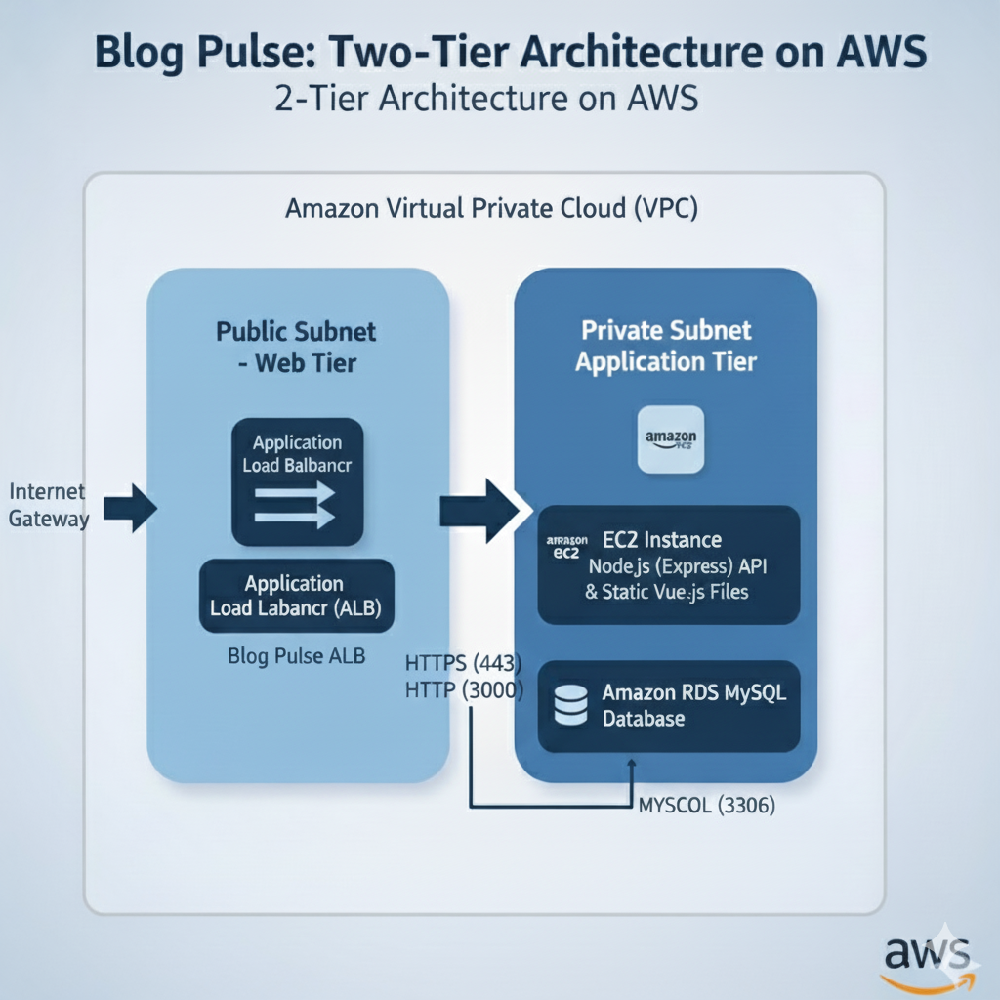

# Blog Pulse: A 2-Tier Full-Stack Application

Blog Pulse is a modern, full-stack, 2-tier web application featuring a Vue.js frontend and a Node.js (Express) backend. The entire infrastructure is defined as code (IaC) using Terraform and is designed for a scalable, secure, and automated deployment on AWS.

This document focuses on the infrastructure, architecture, and deployment process.

# 🚀 Architecture



## 🚀 Key Features

- **Full-Stack Application:** Vue.js 3 (Vite) frontend with a Node.js (Express) API backend.
- **2-Tier AWS Architecture:** Decoupled web and database tiers for security and scalability.
- **Infrastructure as Code (IaC):** Fully automated AWS deployment using Terraform.
- **Dynamic Provisioning:** EC2 instances automatically clone the repo, install dependencies, build the frontend, and start the server.
- **Authentication:** Secure user signup and login using JWT and Google OAuth 2.0.
- **Database:** AWS RDS for a managed MySQL database.

---

## ☁️ AWS Components

### VPC
- Provides a logically isolated network for all resources.
- **Public Subnets:** Contain internet-facing resources (ALB, EC2).
- **Private Subnets:** Contain isolated resources (RDS).

### Application Load Balancer (ALB)
- Acts as the entry point for user traffic.
- Terminates HTTPS and forwards HTTP traffic (port 3000) to EC2.
- Ensures scalability and load distribution.

### EC2 Instance (Web Server)
- Hosts both **frontend and backend**.
- Configured via `user-data.sh`.
- Uses PM2 for persistent backend service management.

### RDS (MySQL)
- Managed MySQL instance hosted in a private subnet.
- Only accessible from EC2 via Security Group rules.

### Security Groups
| Component | Allowed Ingress | Description |
|------------|----------------|--------------|
| **ALB-SG** | 443 (HTTPS) | From public |
| **EC2-SG** | 3000 (HTTP) | From ALB only |
| **RDS-SG** | 3306 (MySQL) | From EC2 only |

---

## ⚙️ Deployment (AWS with Terraform)

### Prerequisites

- AWS Account & CLI configured
- Terraform installed
- GitHub Personal Access Token (PAT) with repo access
- OpenSSL to generate secret key

### 1️⃣ Configuration

**Generate JWT Secret:**
```bash
openssl rand -hex 32
```

**Create `terraform.tfvars`:**
```hcl
github_token = "ghp_YOUR_GITHUB_TOKEN_HERE"
db_username  = "admin"
db_password  = "YourSecurePassword123"
jwt_secret_key = "YOUR_GENERATED_OPENSSL_KEY_HERE"
```

### 2️⃣ Deploy Infrastructure

```bash
terraform init
terraform plan
terraform apply
```

### 3️⃣ What user-data.sh Does

- Installs dependencies (git, mysql-client, nodejs, pm2).
- Clones the GitHub repo.
- Creates `.env` files for backend and frontend.
- Waits for RDS connection and imports schema.
- Builds Vue.js frontend.
- Copies build files into backend.
- Starts Node.js backend with PM2.

After completion, your app is live at the **ALB DNS name**.

### 4️⃣ Redeploying Updates

```bash
terraform taint aws_instance.web
terraform apply
```

This rebuilds the EC2 instance with your latest GitHub code.

---

## 🔐 Environment Variables

### backend/.env (Production)

| Variable | Description | Example |
|-----------|-------------|----------|
| NODE_ENV | Environment mode | production |
| PORT | Server port | 3000 |
| DB_HOST | RDS endpoint | (from terraform) |
| DB_USER | Database username | admin |
| DB_PASSWORD | Database password | from tfvars |
| DB_NAME | Database name | blog_pulse_db |
| JWT_SECRET | JWT signing key | from tfvars |
| VITE_GOOGLE_CLIENT_ID | Google OAuth Client ID | 7978... |

### client/.env (Production)

| Variable | Description | Example |
|-----------|-------------|----------|
| VITE_API_BASE | ALB API endpoint | https://alb-dns/api |
| VITE_GOOGLE_CLIENT_ID | Google OAuth Client ID | 7978... |

### client/.env (Local Development)

| Variable | Description | Example |
|-----------|-------------|----------|
| VITE_API_BASE | Uses Vite proxy | /api |
| VITE_GOOGLE_CLIENT_ID | Google OAuth Client ID | 7978... |

---

## 🧠 Local Development Setup

### Database Setup

```bash
CREATE DATABASE blog_pulse_db;
mysql -u root -p blog_pulse_db < backend/schema.sql
```

### Backend Setup

```bash
cd backend
npm install
npm run server
```

### Frontend Setup

```bash
cd client
npm install
npm run dev
```

App runs at **http://localhost:5173** and proxies `/api` to backend.

---

## 📁 Project Structure

```
.
├── backend/
│   ├── public/           
│   ├── .env              
│   ├── server.js         
│   ├── package.json
│   └── schema.sql        
│
├── client/
│   ├── src/
│   │   ├── components/   
│   │   ├── router/       
│   │   ├── stores/       
│   │   ├── App.vue
│   │   └── main.js
│   ├── .env              
│   ├── package.json
│   └── vite.config.js    
│
└── terraform/
    ├── main.tf           
    ├── variables.tf      
    ├── user-data.sh      
    └── terraform.tfvars  
```

---

## 🧾 License

This project is licensed under the MIT License — free to modify and distribute.
